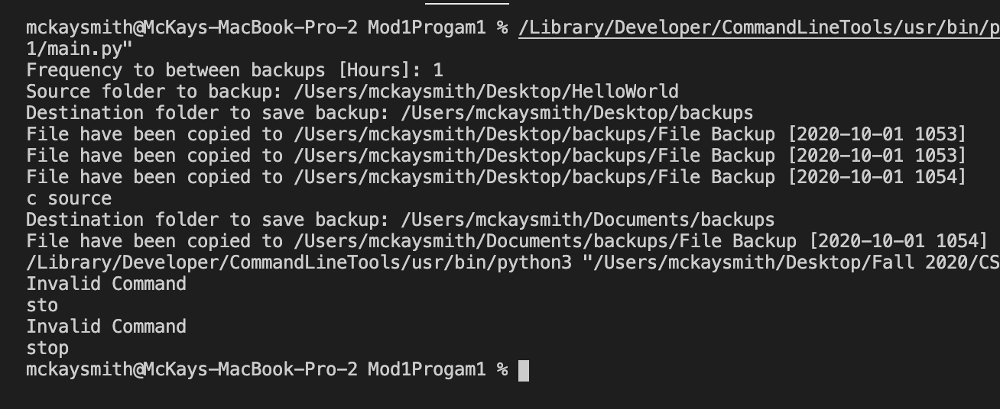

# Description
This program allows the user to back up one folder of their choice. The user can select the source folder, the destiination, and how frequent they want back ups.The users settings will be saved in a settings.json file And can we change it simple commands.

## User Commands
`c destination`: Allow users to change the Destiination of the back up 
`c source`: Allow users to change the folder being back up 
`c time`: Allow users to change the frequencies between back up

# Development Environment
* Visual Studio Code
* Python 3.8.5

# Execution
To execute the program: `Python3 main.py`
 
or
 
click "run" button

# Useful Sites
* [An Intro to Threading in Python](https://realpython.com/intro-to-python-threading/)
* [Stack Overflow](https://stackoverflow.com)
* [Automate the Boring Stuff with Python](https://automatetheboringstuff.com/2e/chapter9/)